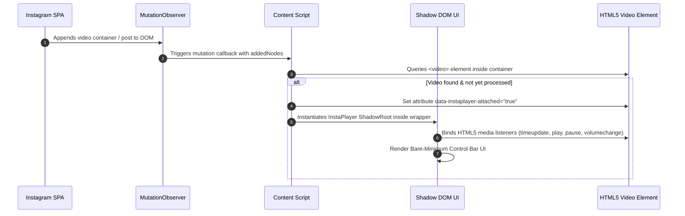

# InstaPlayer - Technical Architecture Document

## 1. Architectural Overview

**InstaPlayer** is designed as a zero-dependency, ultra-lightweight Chrome Extension (Manifest V3) that injects a bare-minimum, high-contrast media control overlay into Instagram's web interface. 

Because Instagram is a Single Page Application (SPA) built with React that frequently mounts and unmounts video elements during user navigation and infinite scrolling, InstaPlayer relies on an event-driven DOM observation pattern combined with Shadow DOM encapsulation.

```
+-----------------------------------------------------------------------------------+
| CHROME EXTENSION RUNTIME                                                          |
|                                                                                   |
|  +-----------------------------------------------------------------------------+  |
|  | CONTENT SCRIPT (content.js)                                                 |  |
|  |                                                                             |  |
|  |  +---------------------+        +----------------------------------------+  |  |
|  |  | MutationObserver    | ------> | Video Detector & Wrapper Injector      |  |  |
|  |  +---------------------+        +----------------------------------------+  |  |
|  |                                                     |                       |  |
|  |                                                     v                       |  |
|  |                                 +----------------------------------------+  |  |
|  |                                 | Shadow DOM Controller (player.js)      |  |  |
|  |                                 +----------------------------------------+  |  |
|  +-----------------------------------------------------|-----------------------+  |
+--------------------------------------------------------|--------------------------+
                                                         | Attaches Shadow Root
                                                         v
+-----------------------------------------------------------------------------------+
| INSTAGRAM DOM                                                                     |
|                                                                                   |
|  +-----------------------------------------------------------------------------+  |
|  | Video Container (<div class="_aaqg">)                                        |  |
|  |                                                                             |  |
|  |   +--------------------------+   +---------------------------------------+  |  |
|  |   | Native <video> Element   |   | InstaPlayer Host Container            |  |  |
|  |   +--------------------------+   | (data-instaplayer-attached="true")    |  |  |
|  |                                  |   +-------------------------------+   |  |
|  |                                  |   | #shadow-root (Open)           |   |  |
|  |                                  |   |   ├── <style> (Bare Minimum)  |   |  |
|  |                                  |   |   └── <div class="player-bar">|   |  |
|  |                                  |   +-------------------------------+   |  |
|  |                                  +---------------------------------------+  |  |
|  +-----------------------------------------------------------------------------+  |
+-----------------------------------------------------------------------------------+
```

---

## 2. Component Breakdown

### 2.1 Content Script Injection (`src/content.js`)
* **Role**: Main extension entry point running within Instagram's isolated world (`ISOLATED`).
* **Responsibilities**:
  1. Instantiates a global `MutationObserver` listening to DOM mutations on `document.body`.
  2. Scans newly appended nodes for Instagram `<video>` elements across Feed, Reels, Explore modals, and Stories.
  3. Wraps or attaches the custom player host element (`<div class="instaplayer-host">`) adjacent to target videos.
  4. Manages lifecycle events (attaching controllers on mount, detaching on video removal).

### 2.2 Shadow DOM Controller (`src/player.js`)
* **Role**: Constructs and manages the bare-minimum UI control bar.
* **Responsibilities**:
  1. Creates an isolated `ShadowRoot` (`attachShadow({ mode: 'open' })`) to prevent CSS style bleed between Instagram and InstaPlayer.
  2. Renders minimal flat HTML structure and attaches SVG icon templates.
  3. Directs bidirectional event synchronization between HTML5 `<video>` properties and Shadow DOM controls.

### 2.3 Style Encapsulation (`src/shadow-styles.css`)
* **Role**: Complete CSS stylesheet loaded inside the Shadow Root.
* **Key Visual Design System**:
  * Background: Flat dark backdrop `rgba(0, 0, 0, 0.75)` or `#121212` for high readability.
  * Border Top: `1px solid rgba(255, 255, 255, 0.1)`.
  * Controls: High contrast white icons and monospaced time text.
  * Custom Range Slider Thumb & Track styling without heavy effects or GPU filters.

---

## 3. Data & Event Flow

### 3.1 Initialization Sequence



### 3.2 Bidirectional Media Event Matrix

| User Trigger | Shadow DOM UI Handler | Target `<video>` Action | Event Listener Callback |
|---|---|---|---|
| Click Play/Pause Button | `onPlayPauseClick()` | `video.paused ? video.play() : video.pause()` | `play` / `pause` updates UI icon |
| Click Mute Button | `onMuteClick()` | `video.muted = !video.muted` | `volumechange` updates UI Mute icon |
| Drag Progress Bar | `onSeekInput(val)` | `video.currentTime = (val / 100) * video.duration` | `timeupdate` moves progress thumb |
| Click Speed Preset | `onSpeedSelect(rate)` | `video.playbackRate = rate` | UI speed button text updates to `rate + 'x'` |
| Click Fullscreen | `onFullscreenClick()` | `wrapper.requestFullscreen()` | Fullscreen state toggles |

---

## 4. Shadow DOM Style Isolation Strategy

To ensure Instagram's global CSS rules do not alter the bare-minimum control bar, and extension styles do not pollute Instagram:

```javascript
function attachInstaPlayer(videoElement) {
  const container = videoElement.parentElement;
  
  const host = document.createElement('div');
  host.className = 'instaplayer-host';
  
  const shadow = host.attachShadow({ mode: 'open' });
  const playerUI = new InstaPlayerUI(videoElement, container);
}
```

---

## 5. Performance & Memory Safety

1. **WeakMap Instance Tracking**: Uses `WeakMap<HTMLVideoElement, InstaPlayerInstance>` to maintain active player instances, allowing automatic garbage collection when Instagram unmounts video elements.
2. **Zero GPU Filter Overhead**: Eliminates backdrop blur filters for maximum rendering speed and low CPU/battery consumption.
3. **Passive Event Listeners**: Media event listeners utilize `{ passive: true }` to preserve smooth scrolling.
